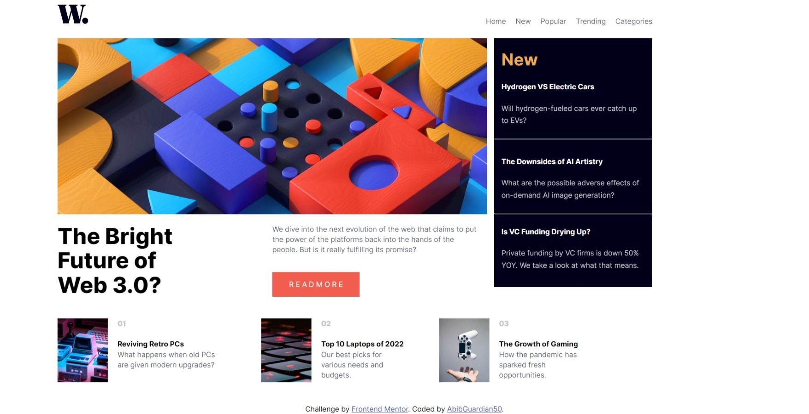
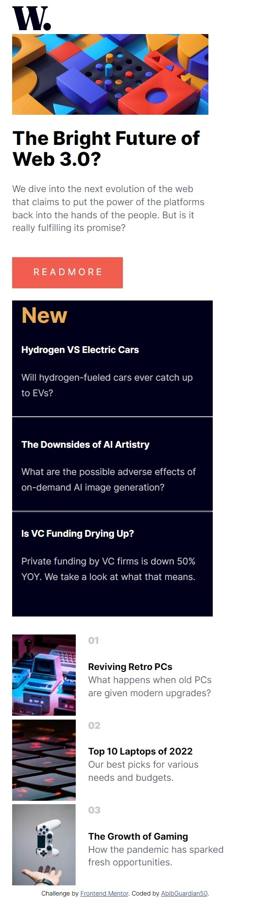

# Frontend Mentor - News homepage solution

This is a solution to the [News homepage challenge on Frontend Mentor](https://www.frontendmentor.io/challenges/news-homepage-H6SWTa1MFl). Frontend Mentor challenges help you improve your coding skills by building realistic projects. 

## Table of contents

- [Overview](#overview)
  - [The challenge](#the-challenge)
  - [Screenshot](#screenshot)
  - [Links](#links)
- [My process](#my-process)
  - [Built with](#built-with)
  - [What I learned](#what-i-learned)
  - [Continued development](#continued-development)
  - [Useful resources](#useful-resources)
- [Author](#author)
- [Acknowledgments](#acknowledgments)

**Note: Delete this note and update the table of contents based on what sections you keep.**

## Overview

### The challenge

Users should be able to:

- View the optimal layout for the interface depending on their device's screen size
- See hover and focus states for all interactive elements on the page

### Screenshot

### Links

- Solution URL: [Add solution URL here](https://github.com/AbibGuardian50/news-homepage-main)
- Live Site URL: [Add live site URL here](https://your-live-site-url.com)

## My process

### Built with

- Semantic HTML5 markup
- CSS custom properties
- Flexbox
- CSS Grid

### What I learned

From this challenge i learned that CSS grid make layout settings easier,and making me have a deeper understand of web development

### Continued development

from this challenge I found that i have to practice more with CSS grid 

### Useful resources

- [resource 1](https://www.w3schools.com/css/default.asp) - This helped me for reminding me about CSS
- [resource 2](https://www.youtube.com/watch?v=qCMLP6GtyBc&list=PLFIM0718LjIXmbwX0dEsoRVX-PC16vmuw) - This is an amazing video learning that teach me a lot about CSS grid
- [resource 3](https://blog.logrocket.com/how-to-prevent-overflow-scrolling-css/) - This helped me for deeper understand about overflow
- [resource 4](https://www.w3schools.com/html/html_responsive.asp) - This teach me a lot about responsive website
- [resource 5](https://flexboxfroggy.com/) - Learn flexbox with games

## Author

- Website - [Muhammad Abieb Basnuril](https://github.com/AbibGuardian50)
- Frontend Mentor - [@AbibGuardian50](https://www.frontendmentor.io/profile/AbibGuardian50)
- Instagram - [@mhd_abib](https://www.instagram.com/mhd_abib/)

## Acknowledgments

This is where you can give a hat tip to anyone who helped you out on this project. Perhaps you worked in a team or got some inspiration from someone else's solution. This is the perfect place to give them some credit.
1. Thanks to @correlucas that from his solution,i get inspiration and idea to solve this challenge
2. Thanks to @PaulHaze that give me great resources to learn css grid and flexbox
3. Thanks to @fritzadelbertus that give me some suggestion on my solutions before
